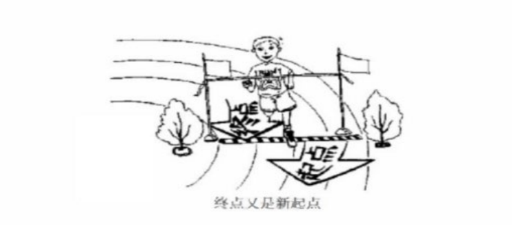

# The first paragraph

## 1.Describe the picture

As is symbolically depicted in figure above ,on the playground runs a young man ,rushing to the finishing line ,with a sweet smile on his face.

**improve**:

As is symbolically depicted in figure above ,on the playground runs a young man ,**active as well as vigorous**,rushing to the finishing line ,with a sweet smile on his face.

As is symbolically depicted in figure above, in front of us  stays an oil lamp,lovely as well as cute,lighting up the darkness,with a sweet smile on its face.

As is symbolically depicted in figure above ,in front of us stand two girls,talking about the lecture of campus. One reckons that campus lectures are not suitable for us,while the other holds that attending lectures  always useful.

The cartoons provides us with a thought-provoking scene(As is symbolically depicted in figure above ),**the girl in the left picture** is completely focusing on her homework and murmuring that i will fell relieved when i finish my work. **However,in the right picture**, a boy is lying on the sofa and saying that i will not start until the last minute.

**improve**:

The cartoons provides us with a thought-provoking scene(As is symbolically depicted in figure above ),the girl in the left picture, **sitting in front of desk**, completely focuses on her homework and says that ... .However, the boy in the right picture **who is lying on the sofa** says that ...

**the topic:** **below the drawing ,there is a topic which says:** (habits)(love is a lamp,the darker the place,the brighter it is.) (starting point is the end)

## 2.The purpose

**something is important!**

The purpose of the drawing **is** to remind **us** that ...  

**is**   seem/appear/keep/remain

**us** 

- human beings/children and adults

- urban residents/ rural residents

- children and kids/ offspring/ descendant

- teenagers and youngsters

1. The purpose of the drawing seems to remind t**eenagers and youngsters** that…

2. Without a doubt, the drawing emphasizes the central idea that...
3. Despite its simplicity, the drawing conveys a truth that...

**e.g**. 1. The purpose of the drawing seems to remind teenagers and youngsters  that the traditional culture is so important that the subject deservers the highest level of attention and consideration.

2. Despite its simplicity, the drawing convers a truth that our government and citizens should give the highest priority to environmental protection.
3. Without a doubt, the drawing and chart emphasize the truth that great achievements have been made in the construction of public facilities by the government.
