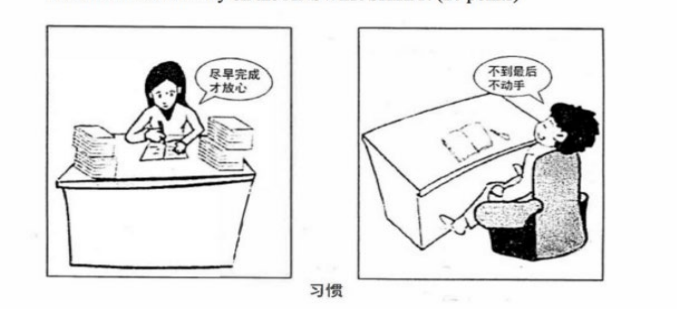

# The first paragraph

## 1.Describe the picture

As is symbolically depicted in figure above ,on the playground runs a young man ,rushing to the finishing line ,**with a sweet smile on his face.**

**improve**:

As is symbolically depicted in figure above ,on the playground runs a young man ,**active as well as vigorous**,rushing to the finishing line ,with a sweet smile on his face.

As is symbolically depicted in figure above, in front of us  stays an oil lamp,lovely as well as cute,lighting up the darkness,with a sweet smile on its face.

As is symbolically depicted in figure above ,in front of us stand two girls,talking about the lecture of campus. One reckons that campus lectures are not suitable for us,while the other holds that attending lectures  always useful.

The cartoons provides us with a thought-provoking scene(As is symbolically depicted in figure above ),**the girl in the left picture** is completely focusing on her homework and murmuring that i will fell relieved when i finish my work. **However,in the right picture**, a boy is lying on the sofa and saying that i will not start until the last minute.

**improve**:

The cartoons provides us with a thought-provoking scene(As is symbolically depicted in figure above ),the girl in the left picture, **sitting in front of desk**, completely focuses on her homework and says that ... .However, the boy in the right picture **who is lying on the sofa** says that ...

**the topic:** **below the drawing ,there is a topic which says:** (habits)(love is a lamp,the darker the place,the brighter it is.) (starting point is the end)

## 2.The purpose

**something is important!**

The purpose of the drawing **is** to remind **us** that ...  

**is**   seems/appear/keep/remain

**us** 

- human beings/children and adults

- urban residents/ rural residents

- children and kids/ offspring/ descendant

- teenagers and youngsters

1. The purpose of the drawing seems to remind t**eenagers and youngsters** that…

2. Without a doubt, the drawing emphasizes the central idea that...
3. Despite its simplicity, the drawing conveys a truth that...

**e.g**. 1. The purpose of the drawing seems to remind teenagers and youngsters  that the traditional culture is so important that the subject deservers the highest level of attention and consideration.

2. Despite its simplicity, the drawing convers a truth that our government and citizens should give the highest priority to environmental protection.
3. Without a doubt, the drawing and chart emphasize the truth that great achievements have been made in the construction of public facilities by the government.

# The second paragraph

**example(optional) + reason + influence**

why is so important?

many

- innumerable
- countless
- abundant
- adequate
- a variety/plenty of 

reason

- factor
- element
- cause

explain

- contribute
- account for

idea

- standpoint
- opinion
- viewpoint
- phenomenon

In my perspective, the cause/advantages/disadvantages of ... mainly lie in three aspects.

**Three** **points**

- Firstly;Secondly;Thirdly
- To begin with;What's more;Last but not least
- above all;furthermore;in the end

##  for example

e.g. For instance , my classmate, David, was addicted to the Internet, which made him fail the final exam. During that period, he regretted everything he had done.

​	For instance, my roommate, Kevin, was addicted to the Internet, which made him  become quiet and reserved. During that period, his real-life friends were becoming  fewer and fewer.

e.g. For instance , my classmate, David, was passionate about reading, which brings him the capacity of writing. During this period, all of us admire his capacity.

​	For instance, my hometown, a beautiful city, is contribute to infrastructure construction. During this period, citizen satisfaction has improved.

##  the good or bad aspect

1. **The majority of individuals maintain that** teamwork spirit will provide them with a  broader platform to enhance themselves, which may put them in a beneficial position in the future.

2. **Definitely no one can deny such an obvious fact that** the popularity of the  Internet **plays a** **crucial role** **in** effective communication and information collection **among various areas.**
3. **A rising number of individuals are coming to the realization that** a healthy lifestyle is strongly dependent on infrastructure development.
4. **There is no doubt that** excellent public sports facilities have a beneficial influence  on the quality of life.
5. not only does  doing something +benefit

##  explain why

- **On the one hand ... On the another hand... Nevertheless ...**
- **not only .. but also...**   Not only dose attending lectures increase the knowledge of undergraduate students, but it also enables them to **expand their horizons**. 
- **if ... , would be ...**  If we ignore the importance of traditional culture, our country and ethnicity would be confronted with an unpromising and fruitless future.           If the government ignored the importance of infrastructure construction, our city would be confronted with an unpromising and fruitless future.
- **it it not hard to imagine that a lack of** ... **will ultimately lead people of this kind** to ...

# The third paragraph

**conclusion + measure + future**

## conclusions

1. It is not difficult to draw the conclusion that enough attention must be turned to **protecting environment** by ourselves and tourists.
2. We should bear in maid that spirit of **perseverance** is of great importance to both our life and study.
3. **By no means should we** give up our efforts to protect the environment.

## measures

1. **authority**	It is imperative for the authority to make strict laws to protect the environment.
2. **individual**       We should also enhance children and adult's awareness of environment protecting.
3. **citizen**              We ought to spare no pains to protect the environment and "global village". 
4. **media**               Mass media, such as radios, televisions, newspapers and the Internet,  should appeal to people to live a low carbon life.
5. **household**       Parents and teachers can set a good example for children on resource  conservation through their own behavior.
6. we could start with small steps such as ...
7. **it is imperative to .... among ... about ...**

## contrast(optional)

1. When it comes to concrete solutions, some people hold that A must assume  responsibility for B. In fact, it is C that plays a crucial role in D

   e.g. When it comes to concrete solutions, some people hold that the **government** must assume responsibility for **the protection of the environment**. In fact, it is **cultivating citizens' consciousness** that plays a crucial role in **protecting environment.**

2. On the surface, A seems to be a sound solution, but when carefully weighing  in the mind, we find that B is more reasonable and effective

​	e.g. On the surface, setting rules based on **scenic location** seems to be a sound solution,  but when 	carefully weighing in the mind, we find that **improvement in citizen  awareness** is more reasonable 	and effective.

## future

1. If all above mentioned measures are achieved, harmony between A and B  will not be far away.

2. Only through the joint efforts of all people can we effectively solve the  problem/ have a better life/ push the social progress.
