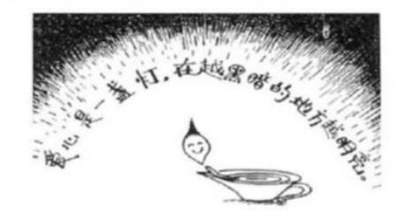
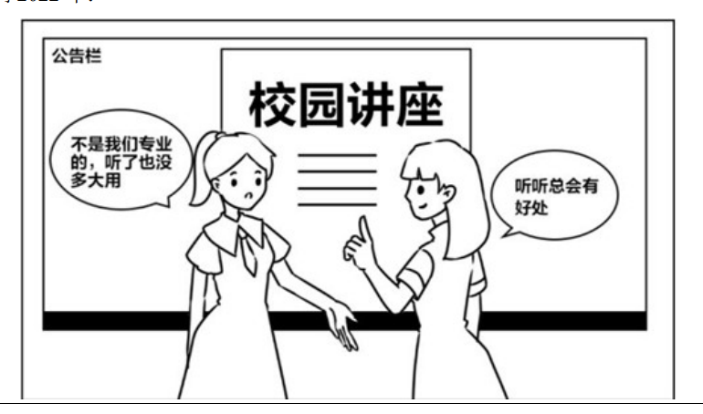
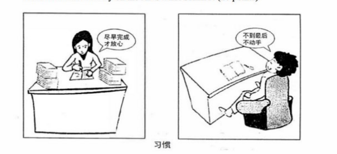

# vocabulary

- nurture personal interests
- persevering and striving
- play a significant role
- persisting
- stay committed to
- cultivate
- shaping and cultivating enthusiasm 
- strengthens  sth
- never give up on sth
- create atmosphere of ..
- ignite one's enthusiasm
- promote overall progress.
- broaden horizon
- lifelong learning
- personal growth

# The first paragraph

## 1.Describe the picture

As is symbolically depicted in figure above ,on the playground runs a young man ,rushing to the finishing line ,**with a sweet smile on his face.**

**improve**:

As is symbolically depicted in figure above ,on the playground runs a young man ,**active as well as vigorous**,rushing to the finishing line ,with a sweet smile on his face.

As is symbolically depicted in figure above, in front of us  stays an oil lamp,lovely as well as cute,lighting up the darkness,with a sweet smile on its face.

As is symbolically depicted in figure above ,in front of us stand two girls,talking about the lecture of campus. One reckons that campus lectures are not suitable for us,while the other holds that attending lectures  always useful.

The cartoons provides us with a thought-provoking scene(As is symbolically depicted in figure above ),**the girl in the left picture** is completely focusing on her homework and murmuring that i will fell relieved when i finish my work. **However,in the right picture**, a boy is lying on the sofa and saying that i will not start until the last minute.

**improve**:

The cartoons provides us with a thought-provoking scene(As is symbolically depicted in figure above ),the girl in the left picture, **sitting in front of desk**, completely focuses on her homework and says that ... .However, the boy in the right picture **who is lying on the sofa** says that ...

**the topic:** **below the drawing ,there is a topic which says:** (habits)(love is a lamp,the darker the place,the brighter it is.) (starting point is the end)

## 2.The purpose

**something is important!**

The purpose of the drawing **is** to remind **us** that ...  

**is**   seems/appear/keep/remain

**us** 

- human beings/children and adults

- urban residents/ rural residents

- children and kids/ offspring/ descendant

- teenagers and youngsters

1. The purpose of the drawing seems to remind t**eenagers and youngsters** that…

2. Without a doubt, the drawing emphasizes the central idea that...
3. Despite its simplicity, the drawing conveys a truth that...

**e.g**. 1. The purpose of the drawing seems to remind teenagers and youngsters  that the traditional culture is so important that the subject deservers the highest level of attention and consideration.

2. Despite its simplicity, the drawing convers a truth that our government and citizens should give the highest priority to environmental protection.
3. Without a doubt, the drawing and chart emphasize the truth that great achievements have been made in the construction of public facilities by the government.

# The second paragraph

**example(optional) + reason + influence**

why is so important?

many

- innumerable
- countless
- abundant
- adequate
- a variety/plenty of 

reason

- factor
- element
- cause

explain

- contribute
- account for

idea

- standpoint
- opinion
- viewpoint
- phenomenon

In my perspective, the cause/advantages/disadvantages of ... mainly lie in three aspects.

**Three** **points**

- Firstly;Secondly;Thirdly
- To begin with;What's more;Last but not least
- above all;furthermore;in the end

##  for example

e.g. For instance , my classmate, David, was addicted to the Internet, which made him fail the final exam. During that period, he regretted everything he had done.

​	For instance, my roommate, Kevin, was addicted to the Internet, which made him  become quiet and reserved. During that period, his real-life friends were becoming  fewer and fewer.

e.g. For instance , my classmate, David, was passionate about reading, which brings him the capacity of writing. During this period, all of us admire his capacity.

​	For instance, my hometown, a beautiful city, is contribute to infrastructure construction. During this period, citizen satisfaction has improved.

##  the good or bad aspect

1. **The majority of individuals maintain that** teamwork spirit will provide them with a  broader platform to enhance themselves, which may put them in a beneficial position in the future.

2. **Definitely no one can deny such an obvious fact that** the popularity of the  Internet **plays a** **crucial role** **in** effective communication and information collection **among various areas.**
3. **A rising number of individuals are coming to the realization that** a healthy lifestyle is strongly dependent on infrastructure development.
4. **There is no doubt that** excellent public sports facilities have a beneficial influence  on the quality of life.
5. not only does  doing something +benefit

##  explain why

- **On the one hand ... On the another hand... Nevertheless ...**
- **not only .. but also...**   Not only dose attending lectures increase the knowledge of undergraduate students, but it also enables them to **expand their horizons**. 
- **if ... , would be ...**  If we ignore the importance of traditional culture, our country and ethnicity would be confronted with an unpromising and fruitless future.           If the government ignored the importance of infrastructure construction, our city would be confronted with an unpromising and fruitless future.
- **it it not hard to imagine that a lack of** ... **will ultimately lead people of this kind** to ...

# The third paragraph

**conclusion + measure + future**

## conclusions

1. It is not difficult to draw the conclusion that enough attention must be turned to **protecting environment** by ourselves and tourists.
2. We should bear in maid that spirit of **perseverance** is of great importance to both our life and study.
3. **By no means should we** give up our efforts to protect the environment.

## measures

1. **authority**	It is imperative for the authority to make strict laws to protect the environment.
2. **individual**       We should also enhance children and adult's awareness of environment protecting.
3. **citizen**              We ought to spare no pains to protect the environment and "global village". 
4. **media**               Mass media, such as radios, televisions, newspapers and the Internet,  should appeal to people to live a low carbon life.
5. **household**       Parents and teachers can set a good example for children on resource  conservation through their own behavior.
6. we could start with small steps such as ...
7. **it is imperative to .... among ... about ...**

## contrast(optional)

1. When it comes to concrete solutions, some people hold that A must assume  responsibility for B. In fact, it is C that plays a crucial role in D

   e.g. When it comes to concrete solutions, some people hold that the **government** must assume responsibility for **the protection of the environment**. In fact, it is **cultivating citizens' consciousness** that plays a crucial role in **protecting environment.**

2. On the surface, A seems to be a sound solution, but when carefully weighing  in the mind, we find that B is more reasonable and effective

​	e.g. On the surface, setting rules based on **scenic location** seems to be a sound solution,  but when 	carefully weighing in the mind, we find that **improvement in citizen  awareness** is more reasonable 	and effective.

## future

1. If all above mentioned measures are achieved, harmony between A and B  will not be far away.

2. Only through the joint efforts of all people can we effectively solve the  problem/ have a better life/ push the social progress.

# 2011

**The cartoon provides us with a though-provoking scene**, a boat taking two tourists is floating  on the lake, one tourist is reading book. However, the other tourist is lettering rubbish. There are a lot of rubbish floating behind of them. **Below the drawing ,there is a ~~topic~~ title which says**: the rest of the tour. **The purpose of the drawing ~~seem~~ seems to remind us that** protecting ~~resort~~ environment is  important for ~~human~~ us.

**There ~~exist~~ exists plenty of causes accounting for ~~the~~ this particular phenomenon in various aspects.** **On the one hand**, some people hold the view that  protecting environment is not their duty but government's. **On the other hand**, some tourist who lack the awareness of protecting landscape, reckoning that is a fuss. **Nevertheless**, if everyone ~~lacked~~ lacks the awareness of protecting environment, the beautiful resort, even our  whole home, would be swallowed by rubbish.

**By no means should we give up our effort to** **cultivate** a good habit.

~~**It is not difficult to draw the conclusion that enough attention must be turned to**(和下面句子有点重复?) protecting environment by tourist and citizen.~~  **By no means should we give up our effort to protecting environments**. **It is imperative for the authority to** enforce strict laws to protect the environment. **Meanwhile**, **tourist also should enhance** their awareness of environment protecting. **Only through the joint efforts of all people can we effectively solve** the  pollution of resort.

"We must not only **reduce plastic usage** but also **actively participate in tree planting** initiatives to protect the environment.

# 2016

The cartoons provides us with a thought-provoking scene. In the left drawing, a father is lying on the sofa, witching the television, and scolding to his son who is doing his work "You must learn !". However, in the left drawing ,the father  is accomplishing his homework with his son. The purpose of the drawing seems to remind us that it is important to be a example for parents.

**revise**: The cartoons present a thought-provoking scene. In the left drawing, a father is lying on the sofa, watching television, and scolding his son, **who is doing his homework**, saying, “You must learn!” However, in the right drawing, the father is doing homework alongside his son. The purpose of the drawing seems to remind us that it is important for parents to set a good example.

The cartoon provides us a thought-provoking scene. A father, in the left cartoon, laying on the sofa , watching the video and scolding to his son:"You should study hard!". His son sitting in front of desk, with unhappiness. In the right cartoon, the father is doing homework along with his son, both of them fill of happiness.

The  purpose of the drawing seems to remind us that being a good example is important than requestion. Definitely no one can deny that good examples play a significant role in shaping children's hobbit and cultivating children's enthusiasm in learning. Not only being a good example alleviate pressure between children and parent, but is also promotes the connection of  family. However, it can be challenging to company with children for a busy father. Yet, by persevering and striving to be a good example in leisure time, children gradually become more happy and fortunate.

we should never give up being a good example. Nor should we entertaining when other is learning or working. It is imperative to raise awareness among family and society about the importance of being examples. Only through collective efforts can we create a excellent learning atmosphere for children.  

ChatGPT: Here's a revised version of your essay along with suggestions:

---

The cartoon presents a thought-provoking scene. In the left panel, a father is lying on the sofa, watching a video, and scolding his son, saying, "You should study hard!" The son, sitting at his desk, looks unhappy. In the right panel, the father is doing homework alongside his son, and both are filled with happiness.

**The purpose of the drawing seems to remind us that** setting a good example is more important than simply making demands. No one can deny that good examples play a significant role in shaping children's habits and cultivating their enthusiasm for learning. **Being a good example** **not only** eases the tension between parents and children **but also** strengthens family bonds. However, it can be challenging for a busy father to spend time with his children. Yet, by persevering and striving to be a good role model during their free time, fathers can help their children grow happier and more successful.

We should never give up on being good examples. Nor should we entertain ourselves when others are learning or working. It is imperative to raise awareness within families and society about the importance of setting good examples. Only through collective efforts can we create an excellent learning atmosphere for children.

---

1. **Grammar and sentence structure**: There were issues with grammar, particularly verb tenses and sentence flow. For instance, "laying on the sofa" was corrected to "lying on the sofa," and "requestion" was changed to "making demands."

2. **Clarity**: I replaced certain phrases for clarity, such as "being a good example alleviate pressure" with "being a good example eases tension." This makes the point clearer and more precise.

3. **Vocabulary**: Some words were substituted with more appropriate ones, like "entertaining" was changed to "entertain ourselves" for better understanding.

4. **Flow and coherence**: I've improved transitions between sentences and sections to make the essay flow more smoothly. For instance, I connected the father's challenges with being a good example to the effect it has on children.

5. **Minor factual correction**: "Hobbit" was replaced with "habits."

Let me know if you'd like further help!

# 2020

**The cartoon provide us a thought-provoking scene**. **In the left cartoon**, a girl who is sitting in front of a desk, concentrated on her housework, and saying:"i will release when i finish my work early." The boy in the right cartoon, laying on the sofa and murmuring:" i will never do it until the least time." The purpose of the cartoons seem to remind us that a good habit is important.

For instance, my classmate, David, was always finish his homework first, which bring him a lot of spare time to learn what he interested. During this period, all of us admire his good habit. **Definitely no one can deny such obvious fact that good habits play a crucial role in our life**. It is not hard to imagine that a lack of a good habit will ultimately lead people to increase pressure and work ineffectively.

**By no means should we give up our effort to** **cultivate** a good habit. ~~We should enhance students and adult's awareness of good habits.~~ **It’s ~~important~~ imperative to raise awareness among** **students and adults about the importance of forming good habits**. In a word, we may start with small steps such us finish homework early.

**ChatGPT **: **The cartoon provides us with a thought-provoking scene. In the left panel**, a girl is sitting in front of a desk, concentrating on her homework, and saying, "I will relax when I finish my work early." **In contrast,** the boy in the right panel is lying on the sofa, murmuring, "I will never do it until the l**ast minute**." **The purpose of the cartoons seems to remind us that** developing good habits is important.

**For example, my classmate David** always finished his homework first, **which** gave him a lot of free time to learn about what **interested him.** During this time, all of us admired his good habit. **No one can deny the obvious fact that** good habits play a crucial role in our lives. **It’s easy to imagine that lacking** good habits will ultimately lead to increased pressure and ineffective work.

**We should never give up our efforts to** cultivate good habits. **It’s ~~important~~ imperative to raise awareness among** **students and adults about the importance of forming good habits**. **In short, we can start with small steps**, such as finishing homework early.

# 2021

The cartoon provides us a thought-provoking scene. The boy who is dressing a costume"Monkey King", complaining to his father:"How many classmate thinks that singing opera is uninteresting." His father comfort him with encouragement:"It is matter that you love it".

The purpose of drawing seems to remind us that insisting own interests is important. Definitely no one can deny that our own interests is play a crucial role in personal goals and values. Not only insisting own interests improve personal ability and skill, but it also promote lifelong education and learning. Meanwhile, it is hard to insisting own interesting when you suffer critique and incomprehension. However, when you persevering and endeavoring for your interesting, you will gradually become an admirable human.

By no means should we give up our own interests. We should not shame to have a different interests. It is imperative  that to raise awareness among students and parents about the importance of promoting own interests and hobby. Only through the joints efforts can we create a inclusive and diverse world for children.

**CHAGPT**: **The cartoon presents a thought-provoking scene**. A boy dressed as the "Monkey King" is complaining to his father: "Many of my classmates think that singing opera is **boring**." His father **==reassures==** him **with words of encouragement**: "What matters is that you love it."

**The purpose of the drawing seems to remind us that** ==persisting== in our own interests is crucial. **Undoubtedly, no one can deny that** our personal interests play a **==significant==** role in shaping our goals and values. **Not only does pursuing one's interests** improve individual abilities and skills, **but it also promotes** lifelong learning and personal growth. However, it can be challenging to ==stay committed to== our passions when faced with criticism and misunderstanding from others. Yet, **by ==persevering and striving== for what we love**, we gradually become more **admirable individuals**.

**We should never give up on our own interests.** **Nor should we** feel ashamed of having unique hobbies. **It is imperative to raise awareness among students and parents about the importance of** **==nurturing==** personal interests and hobbies. **Only through collective efforts can we** create an inclusive and diverse world for children, **where** everyone’s uniqueness is respected and celebrated.

# 2022

**The drawing presents a thought-provoking scene for us.** Two girls stand in front of a board that says "School Lecture." One girl, looking discouraged, says, "This school lecture is not our major; it is useless." However, the other girl, appearing delighted, says, "Let's go. It always has benefits."

**This drawing seems to remind us that learning broadly is important for** students. **No one can deny that** taking different lectures **plays a significant role in** helping students gain diverse knowledge and promote overall progress. **My classmate, David,** attends a variety of lectures, which has helped him broaden his horizons and sparked his enthusiasm for other subjects. **We all admire him for this**. **Some people think it is useless to attend lectures outside their major,** **believing** that this knowledge won't be used in the future. **However,** I believe attending different lectures will greatly help in cultivating a well-rounded individual.

**By no means should we give up** attending other lectures, **nor should we** stubbornly focus only on our major. **It is essential to raise awareness about the importance of** diverse learning among students. **Only through such efforts** **can we create an atmosphere** that encourages students to learn widely.

CHATGPT:

The picture shows two students standing in front of a notice board with an announcement about a campus lecture. The girl on the left seems uninterested, saying, "It's not related to our major; listening to it won’t be of much use." The boy on the right, however, encourages her to attend, saying, "Go listen; there will definitely be benefits."

The implied meaning here is a difference in attitudes towards learning beyond one's specific field of study. While the girl views the lecture as irrelevant because it does not directly connect to her major, the boy values the opportunity for broader learning. This scene highlights the importance of having an open-minded approach to knowledge acquisition and being willing to learn outside one's immediate academic focus.

In my view, the boy’s perspective is more beneficial in the long term. Learning beyond one's specialization can broaden one's horizons, foster critical thinking, and may even open unexpected opportunities. In today’s fast-paced world, a flexible and curious approach to learning is essential for personal and professional growth.

# 2019

	

​	The cartoon provides us a thought-provoking scene. Two young mans are climbing, one is siting down on the staircase with exhausted and complaint:" I am so tired that I give up." However, the another one encouraging and picking a water bottle to him, saying:"Never give up! We can take a rest and then climb".

​	The purpose of drawing seems to remind us that perseverance is important for us. Undoubtedly, no one can deny that perseverance play a significant role in shaping our value and goal. Perseverance not only helps us to pursuit our dreams, but also promotes lifelong learning and personal growth. However, it can be challenging to stay committed to achieve our goals when faced with exhausted and trouble. Yet, by insisting and striving , we  gradually make dreams and goals come true.

​	We should never give up on our goals. Nor should we stop our steps when we almost finish. It is imperative to raise awareness among young and adult about the importance of perseverance. Only through persistent endeavor can we realize the value of life. In a ward, just do it!

**revise:** 

​	**The cartoon presents a thought-provoking scene**. Two young men are climbing a staircase. One is sitting down, exhausted, and complaining, saying, "I am so tired, I give up." However, the other encourages him, offering a water bottle and saying, "Never give up! We can take a rest and then continue climbing."

**The purpose of the drawing seems to remind us that perseverance is essential**. Undoubtedly, no one can deny that perseverance plays a significant role in shaping our values and achieving our goals. Perseverance **not only** helps us pursue our dreams **but also** promotes lifelong learning and personal growth. However, it can be challenging to **stay committed** when we face exhaustion and difficulties. Yet, by persisting and striving, we gradually **turn our dreams and goals into reality.**

We should never give up on our goals. Nor should we stop just when we are close to finishing. It is imperative to raise awareness among both the young and adults about the importance of perseverance. Only through persistent effort can we realize the true value of life. In a word, just do it!

# 2023

The cartoon provides us with a thought-provoking scene. Two individuals are on a dragon boat, participating in a dragon boat contest with glittering smiles. In front of them, two elders stand on the shore, exclaiming, "How great it is! Our dragon boat contest is more popular than ever." Meanwhile, a large crowd of people surrounds the banks, watching this incredible event.

This drawing seems to remind us of the importance of cultural traditions. Undoubtedly, no one can deny that traditions play a significant role in national progress and personal growth. Traditions not only allow us to experience the rich and majestic cultures of our nation but also greatly benefit us by enhancing our confidence in our country and igniting our enthusiasm for preserving our cultural heritage.

It is easy to imagine that if we neglect our unique traditions and cultural identity, our sense of personal worth and our goals as a nation will be diminished. By no means should we abandon our traditions, nor should we ignore or undervalue them. It is imperative to raise awareness among both young people and adults about the significance of preserving traditions. Meanwhile, the government should enforce supportive policies and laws to promote the development and protection of cultural heritage.

Only through our collective efforts can we build a brighter future and create a more prosperous nation.
